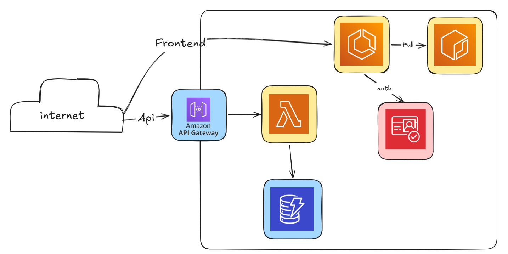

# Chat App on AWS

Real-time chat application built with Vue 3 on the frontend and a serverless WebSocket backend on AWS.

## Purpose

This project provides a production-style chat system with:
- Cognito authentication (OAuth2 authorization code flow)
- Real-time messaging over API Gateway WebSocket
- Presence (online/offline), typing indicators, room management
- Persistent data in DynamoDB
- Infrastructure as code with Terraform
- Frontend containerization and optional CI image publishing to ECR

## High-Level Architecture

- Frontend (Vue + Vite + Nginx container)
- Amazon Cognito for authentication
- API Gateway WebSocket API (route by `action` in message body)
- Lambda functions for connect/disconnect and chat actions
- DynamoDB tables for users, rooms, messages, and connections
- ECS Fargate service to host frontend container image
- ECR repository for frontend images
- Terraform manages all AWS resources

Architecture diagram:



Flow:
1. User signs in through Cognito hosted UI.
2. Frontend exchanges auth code for access/id tokens.
3. Frontend opens WebSocket connection to API Gateway with access token.
4. `$connect` Lambda validates JWT and stores the active connection.
5. Chat actions (`sendMessage`, `getRooms`, `createRoom`, etc.) invoke dedicated Lambdas.
6. Lambdas read/write DynamoDB and push real-time events back through API Gateway Management API.

## Project Structure

```text
chat-app-aws/
  auth-lambda/                  # Lambda for $connect auth + connection registration
  backend/                      # Chat action Lambdas (rooms, messages, typing, users, disconnect)
    layer/nodejs/               # Shared helper for posting to websocket connections
  front/                        # Vue 3 frontend
    src/services/               # Auth and websocket client services
    src/views/                  # Home, sign-in callback, chat screens
  terrafom/                     # Terraform (note the folder name is terrafom)
    bootstrap/                  # Creates remote Terraform backend (S3 + DynamoDB lock)
    resources/                  # Main AWS resources (Cognito, API GW, Lambda, DynamoDB, ECS, ECR)
  .github/workflows/            # GitHub Actions workflow for building/pushing frontend image
```

## Main Components

### Frontend (`front/`)
- Vue Router pages: home, sign-in, callback, chat.
- `src/services/auth.js`: Cognito login/logout, code-to-token exchange, cookie token storage.
- `src/services/websocket.js`: WebSocket lifecycle, reconnection, offline queue, action methods.

### Backend Lambdas (`backend/`, `auth-lambda/`)
- `$connect`: validates Cognito access token and marks user online.
- `$disconnect`: removes connection and marks user offline when last connection closes.
- Action handlers: `CreateRoom`, `GetRooms`, `GetMessages`, `SendMessage`, `Typing`, `LeaveRoom`, `GetAllUsers`.
- `RegisterNewUser`: creates a user record from Cognito trigger payload.

### Infrastructure (`terrafom/`)
- `bootstrap/`: creates S3 state bucket and DynamoDB lock table.
- `resources/`: deploys API Gateway WebSocket routes, Lambdas, DynamoDB tables, Cognito, ECR, ECS.

## WebSocket Actions and Events

Client actions sent to WebSocket:
- `connect`
- `listUsers`
- `getRooms`
- `getMessages`
- `createRoom`
- `sendMessage`
- `isTyping`
- `leaveRoom`
- `disconnect`

Typical server events returned:
- `ROOMS_FETCHED`
- `NEW_MESSAGE`
- `ROOM_CREATED`
- `USER_ONLINE`
- `USER_OFFLINE`

## Prerequisites

- AWS account with permissions for: Cognito, API Gateway, Lambda, DynamoDB, ECS, ECR, IAM, VPC, S3
- Terraform >= 1.5
- Node.js 20+
- npm
- Docker (for building frontend image)
- AWS CLI configured (`aws configure`)

## Deployment

### 1. Bootstrap Terraform backend (one time)

```bash
cd terrafom/bootstrap
terraform init
terraform plan
terraform apply
```

This creates:
- S3 bucket for Terraform state
- DynamoDB table for state locking

### 2. Configure environment values

Create your tfvars file from the sample:

```bash
cd terrafom/resources
cp variables.auto.tfvars.sample variables.auto.tfvars
```

Then set values in `variables.auto.tfvars`.

Required values:
- `region`
- `client_id`
- `client_secret`

Set frontend image value for ECS deployment:
- `image` (must be the full ECR image URI with tag)
- Example: `<account>.dkr.ecr.<region>.amazonaws.com/chat-app/front:<tag>`

If you use the GitHub pipeline, the image tag is the commit SHA (`github.sha`).
Use that SHA tag in `variables.auto.tfvars` for the `image` value.

### 3. Deploy core resources

```bash
cd ../resources
terraform init
terraform plan
terraform apply
```

### 4. Capture outputs

After apply, note outputs such as:
- `cognito_domain`
- `cognito_client_id`
- `repository_url`
- `stage_url` (WebSocket stage URL output)

Use `stage_url` directly for your frontend WebSocket endpoint.

### 5. Build and push frontend image

Manual option:
```bash
cd ../../../front
docker build -t chat-app-front:latest .
# tag + push to your ECR repository, then update terraform image variable and re-apply if needed
```

CI option:
- Workflow in `.github/workflows/github_actions.yaml` builds and pushes image to ECR on manual dispatch.
- The pushed image tag is the commit SHA.
- Copy that SHA tag and update `image` in `terrafom/resources/variables.auto.tfvars`.
- Run `terraform apply` again in `terrafom/resources` to roll ECS to the new image.

## Google OAuth Setup (for Cognito IdP)

`client_id` and `client_secret` should come from Google Auth Platform (Google Cloud Console OAuth credentials).

When creating Google OAuth credentials, add this as an Authorized redirect URI:

`https://COGNITO_DOMAIN.auth.REGION.amazoncognito.com/oauth2/idpresponse`

Replace:
- `COGNITO_DOMAIN` with your Cognito domain output
- `REGION` with your AWS region

## Frontend Configuration

Create `front/.env.local` from `front/.env.example` and set:

- `VITE_COGNITO_DOMAIN`
- `VITE_COGNITO_REGION`
- `VITE_COGNITO_CLIENT_ID`
- `VITE_COGNITO_REDIRECT_URI`
- `VITE_COGNITO_SCOPES`
- `VITE_WS_URL` (set this to your `stage_url` output)
- Optional: `VITE_COGNITO_LOGOUT_URI`

Important:
- Frontend WebSocket connection uses `VITE_WS_URL`.

## Run Locally (Frontend)

```bash
cd front
npm install
npm run dev
```

App runs on:
- `http://localhost:3000`

## How to Use

1. Open the frontend in browser.
2. Click Sign In and authenticate through Cognito.
3. After callback, you are redirected to chat.
4. Start direct chat with `+` or create a group.
5. Send messages, view presence, and typing indicators.
6. Leave room or logout when done.

## Notes and Known Gaps

- Repository folder is named `terrafom` (not `terraform`).
- Backend state bucket name is hardcoded in `terrafom/resources/main.tf`; align it with your bootstrap output if different.
- Some Terraform examples include placeholder values and should be updated before production use.
- No automated tests are currently defined in this repository.

## Future Improvements

- Add health checks and load balancing for ECS frontend.
- Add unit/integration tests for Lambda handlers.
- Add observability (CloudWatch dashboards/alarms, tracing).
- Add deployment environments (`dev`, `staging`, `prod`).
